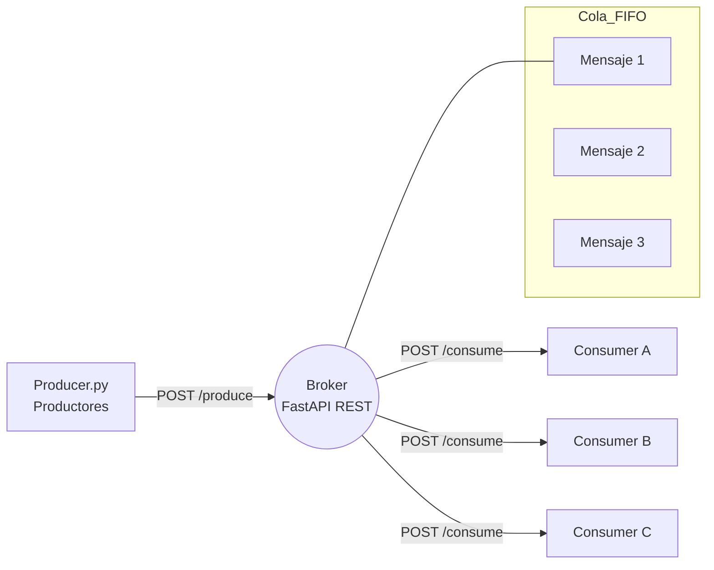
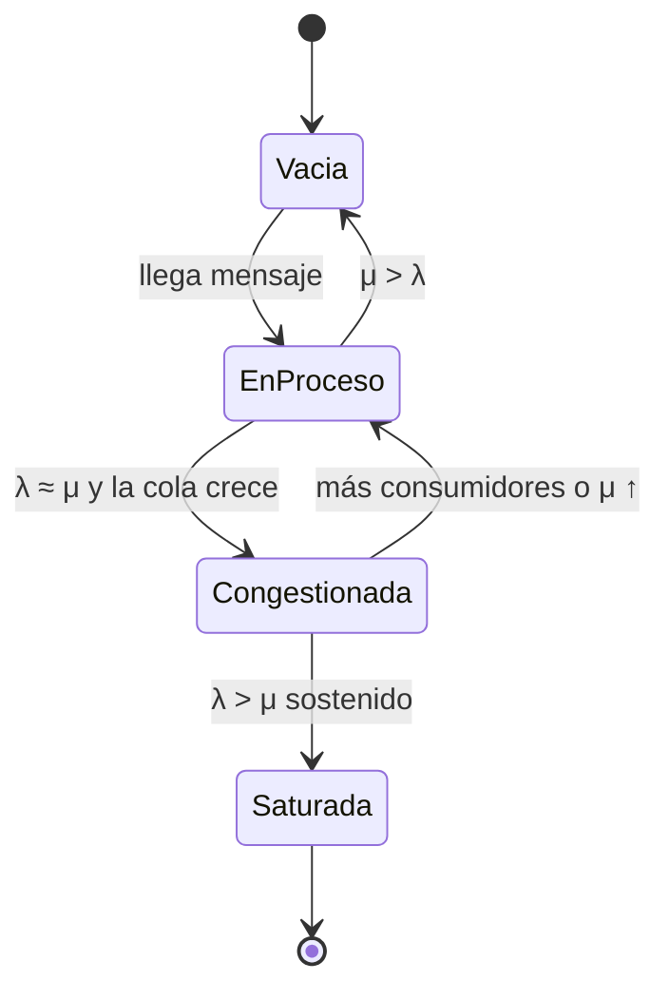

Sistema de Colas con Broker Intermediario (Python + FastAPI)
============================================================
Sistema de mensajería con cola FIFO, broker intermedio y scripts de productor/consumidor para observar dinámica de llegadas (λ), servicios (μ), congestión y balanceo de carga. Ideal para ejercicios de Modelado y Simulación.

Características clave
- Broker REST en FastAPI + Uvicorn con cola FIFO basada en `deque`.
- Productor configurable que genera mensajes periódicos.
- Consumidores paralelos con tiempos de servicio variables e identificadores propios.
- Métricas en vivo: longitud de cola, producidos/consumidos, tiempo promedio de espera.
- Dashboard en consola del broker y endpoints para observar estado y métricas.

Arquitectura


Componentes
1. **Broker (`broker.py`)**
   - Cola FIFO con `collections.deque`.
   - Endpoints: `POST /produce`, `POST /consume`, `GET /metrics`, `GET /queue`.
   - Dashboard en consola con largo de cola, espera promedio y totales.
2. **Productor (`producer.py`)**
   - Genera mensajes cada *X* segundos para simular flujo de entrada.
3. **Consumidor (`consumer.py`)**
   - Consume mensajes del broker, simula procesamiento con `sleep` y soporta múltiples instancias.

Instalación
1. (Opcional) Crear entorno virtual  
   ```bash
   python -m venv venv
   # Linux/Mac
   source venv/bin/activate
   # Windows
   # venv\Scripts\activate
   ```
2. Instalar dependencias  
   ```bash
   pip install fastapi uvicorn requests colorama
   ```

Ejecución rápida
1. Iniciar el broker  
   ```bash
   python broker.py
   ```
   Docs interactivas: http://127.0.0.1:8000/docs

2. Arrancar el productor  
   ```bash
   python producer.py
   ```
   Ejemplo de mensaje: `Pedido #23 - Combo hamburguesa`

3. Lanzar uno o varios consumidores  
   ```bash
   python consumer.py A
   python consumer.py B
   python consumer.py C
   ```
   Cada consumidor muestra sus propios colores y logs.

Métricas y estado
- Métricas: `GET http://127.0.0.1:8000/metrics`
  ```json
  {
    "queue_length": 5,
    "total_produced": 20,
    "total_consumed": 15,
    "avg_wait_time_seconds": 0.83
  }
  ```
- Estado de la cola: `GET http://127.0.0.1:8000/queue`

Teoría de colas aplicada
- **Sistema estable (λ < μ):** la cola se mantiene baja o vacía.  
  Ejemplo: productor cada 2s; 3 consumidores procesando cada 1–4s.
- **Sistema en tensión (λ ≈ μ):** la cola crece y baja lentamente.  
  Ejemplo: productor cada 0.5s; consumidores procesando 2–4s.
- **Sistema saturado (λ > μ):** la cola crece indefinidamente.  
  Cómo provocarlo: productor rápido (`sleep(0.2)`), consumo lento (`sleep(random.uniform(4, 7))`), o solo 1 consumidor.

Estructura del proyecto
```
.
├─ broker.py        # API + cola + métricas + dashboard
├─ producer.py      # Productor de mensajes
└─ consumer.py      # Consumidor con colores y procesamiento
```

Dashboard interno (salida del broker)
```
===== ESTADO DEL SISTEMA =====
 Cola FIFO: [23, 24, 25, 26]
 Largo cola: 4
 Producidos: 30
 Consumidos: 25
 Espera prom: 0.83 s
==============================
```

Diagrama de estados de la cola


Escenarios de simulación sugeridos
- Estable: 1 productor lento, 2+ consumidores rápidos → cola rara vez > 1.
- En tensión: productor cada 0.5s, consumidores 2–4s → cola sube y baja.
- Saturado: productor cada 0.2s, 1 consumidor lento (4–7s) → crecimiento sin límite.

Conclusiones
- Demostración del patrón Productor → Broker → Consumidor con cola FIFO estricta.
- Balanceo de carga con múltiples consumidores y métricas en tiempo real.
- Útil para simulación académica y para entender arquitecturas de colas modernas.
